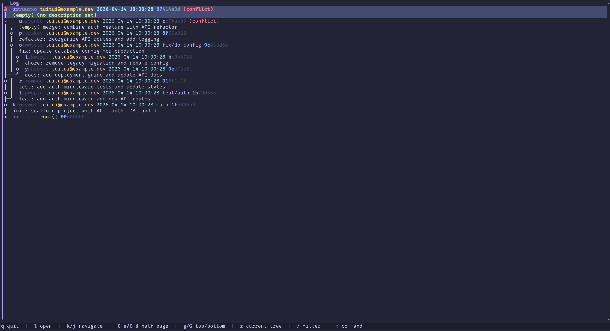
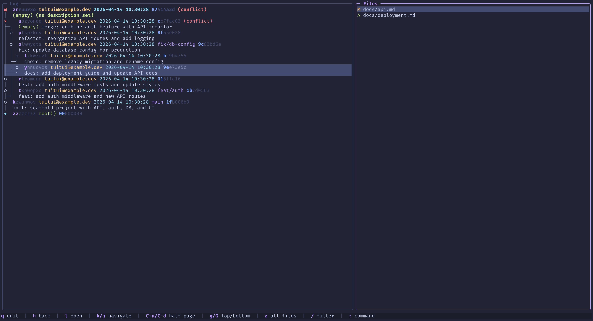
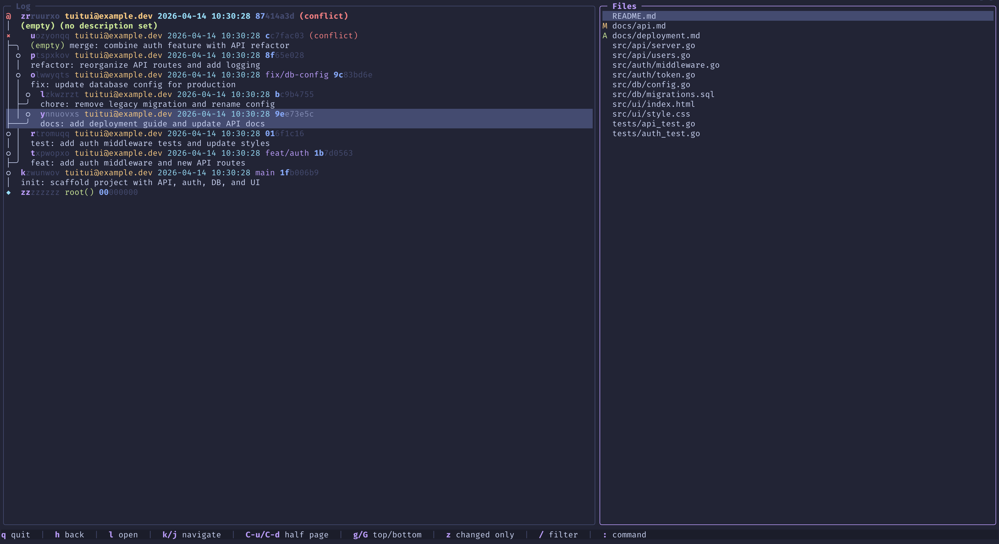
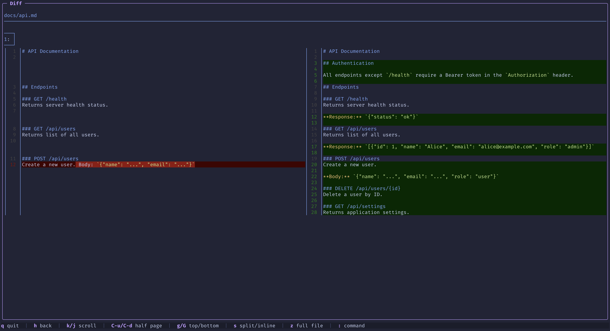
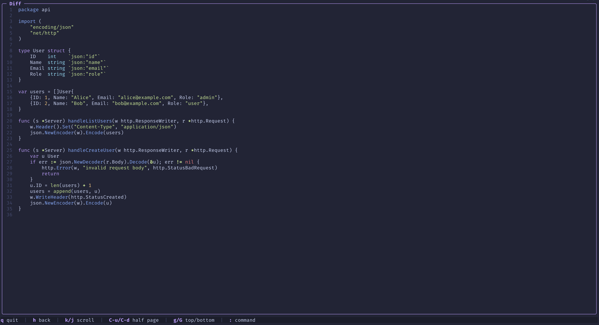
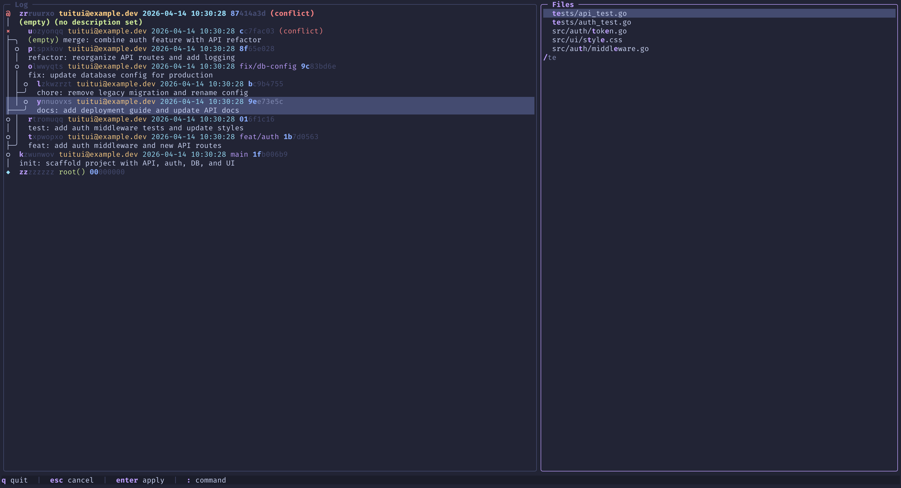
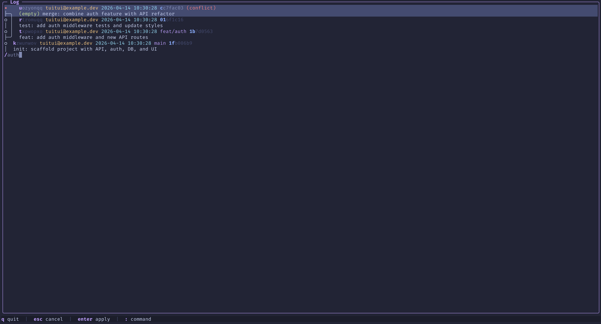
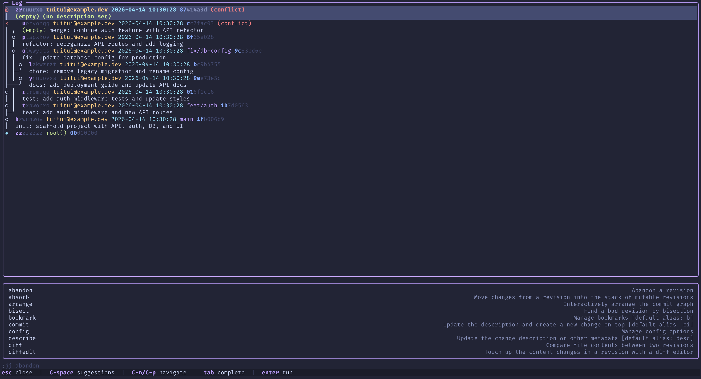
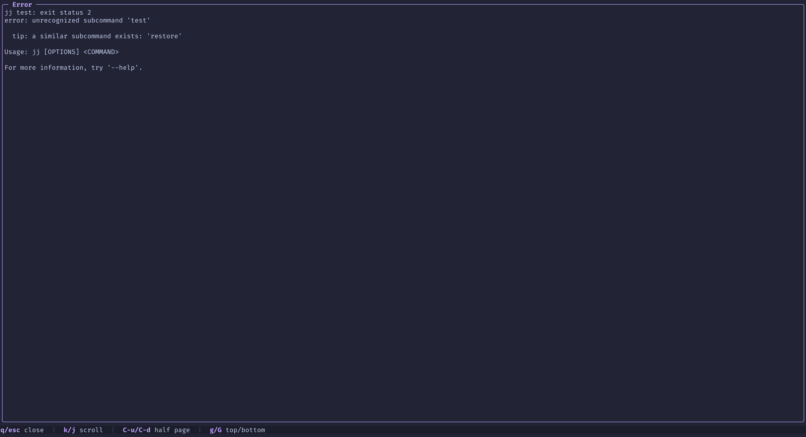

# tuitui

```
⠴⠶⣖⡋⠉⠍⠑⠢⡀⠀⠀⠀⠀⠀⠀⠀⠀⠀⠀⠀⠀⠀⠀⠀⠀⠀⠀⠀  ⠀⠀⠀⠀⠀⠀⠀⠀⠀⠀⠀⠀⠀⠀⠀⠀⠀⠀⠀⢀⠔⠊⠩⠉⢙⣲⠶⠦
⠀⠀⠀⢣⠀⠀⠀⠀⠘⢦⡀⠀⠀⠀⠀⠀⠀⠀⠀⠀⠀⠀⠀⠀⠀⠀⠀⠀  ⠀⠀⠀⠀⠀⠀⠀⠀⠀⠀⠀⠀⠀⠀⠀⠀⠀⢀⡴⠃⠀⠀⠀⠀⡜⠀⠀⠀
⠀⠀⣠⠼⡆⠀⢀⡔⠊⠉⠉⠓⠦⣄⡀⠀⠀⠀⠀⠀⠀⠀⠀⠀⠀⠀⠀⠀  ⠀⠀⠀⠀⠀⠀⠀⠀⠀⠀⠀⠀⠀⢀⣠⠴⠚⠉⠉⠑⢢⡀⠀⢰⠧⣄⠀⠀
⠀⠀⠈⠚⡇⠀⠀⠃⠀⠀⠀⠀⠀⠀⠈⠓⢄⡀⠀⠀⠀⠀⠀⠀⠀ tuitui⠀⠀⠀⠀⠀⠀⠀⠀⢀⡠⠚⠁⠀⠀⠀⠀⠀⠀⠘⠀⠀⢸⠓⠁⠀⠀
⠀⠀⠀⠀⠘⣄⠀⠀⠀⠀⠀⠀⠀⠀⠀⠀⠀⠙⠢⣀⠀⠀⠀⠀⠀⠀⠀⠀  ⠀⠀⠀⠀⠀⠀⠀⠀⣀⠔⠋⠀⠀⠀⠀⠀⠀⠀⠀⠀⠀⠀⣠⠃⠀⠀⠀⠀
⠀⠀⠀⠀⠀⠈⠲⣄⠀⠀⠀⠀⠀⠀⠒⠤⣀⠀⠀⠈⠳⣄⠀⠀⠀⠀⠀⠀  ⠀⠀⠀⠀⠀⠀⣠⠞⠁⠀⠀⣀⠤⠒⠀⠀⠀⠀⠀⠀⣠⠖⠁⠀⠀⠀⠀⠀
⠀⠀⠀⠀⠀⠀⠀⠀⠉⠒⠤⢄⣀⣀⠀⠀⠀⢉⣓⠲⠀⣬⣕⡦⠀⠀⠀⠀  ⠀⠀⠀⠀⢴⣪⣥⠀⠖⣚⡉⠀⠀⠀⣀⣀⡠⠤⠒⠉⠀⠀⠀⠀⠀⠀⠀⠀
⠀⠀⠀⠀⠀⠀⠀⠀⠀⠀⠀⠀⠸⠿⠛⡶⠋⠁⠈⠑⣄⠘⢆⠀⠀⠀⠀⠀  ⠀⠀⠀⠀⠀⡰⠃⣠⠊⠁⠈⠙⢶⠛⠿⠇⠀⠀⠀⠀⠀⠀⠀⠀⠀⠀⠀⠀
⠀⠀⠀⠀⠀⠀⠀⠀⠀⠀⠀⣠⠎⢀⠞⠁⠀⠀⠀⠀⠈⢢⡈⠳⡀⠀⠀⠀  ⠀⠀⠀⢀⠞⢁⡔⠁⠀⠀⠀⠀⠈⠳⡀⠱⣄⠀⠀⠀⠀⠀⠀⠀⠀⠀⠀⠀
⠀⠀⠀⠀⠀⠀⠀⠀⠀⠀⠒⠓⠒⠛⠂⠀⠀⠀⠀⠀⠀⠀⠱⡄⠙⣄⠀⠀  ⠀⠀⣠⠋⢠⠎⠀⠀⠀⠀⠀⠀⠀⠐⠛⠒⠚⠒⠀⠀⠀⠀⠀⠀⠀⠀⠀⠀
⠀⠀⠀⠀⠀⠀⠀⠀⠀⠀⠀⠀⠀⠀⠀⠀⠀⠀⠀⠀⠀⠀⠀⠈⠦⢬⡦⠀  ⠀⢴⡥⠴⠁⠀⠀⠀⠀⠀⠀⠀⠀⠀⠀⠀⠀⠀⠀⠀⠀⠀⠀⠀⠀⠀⠀⠀
```

A terminal user interface for [Jujutsu (jj)](https://github.com/jj-vcs/jj) version control, built in Go with [Bubble Tea v2](https://charm.land/bubbletea).

The name and logo are inspired by the [tui](<https://en.wikipedia.org/wiki/Tui_(bird)>), a songbird native to New Zealand (one of my favorite places). The jj logo features two birds, so tuitui felt like a natural fit: two tui birds facing each other, with the doubled name mirroring jj's convention of repeating letters.



## Features

- **Graph log** — displays the jj commit graph with full DAG structure, colors, and working copy indicator; fuzzy filtering by change ID, description, bookmarks, or tags
- **File browser** — lists changed files per revision with status indicators (A/M/D/R), conflict markers, fuzzy filtering, and toggle between changed/all files
- **Diff panel** — shows syntax-highlighted diffs piped through [delta](https://github.com/dandavison/delta), with side-by-side and inline layouts; plain file view with syntax highlighting via [chroma](https://github.com/alecthomas/chroma)
- **Command bar** — run any jj command with `:`; includes dynamic completion powered by jj's built-in shell completion engine, ghost text, and a navigable suggestions dropdown
- **Error viewer** — failed jj commands display their output in a full-screen, scrollable panel
- **Live updates** — polls the repository for changes and auto-refreshes all open panels
- **Vim-style navigation** — `j`/`k`, `ctrl+u`/`ctrl+d`, `g`/`G`
- **Mouse support** — scroll with the mouse wheel, click to select entries, click an already-selected item to open it, and click on a panel to focus it in split view
- **ANSI palette colors** — adapts to your terminal's color scheme automatically

### File browser



### All files in revision



### Diff panel



### Plain file viewer



### Fuzzy filter (files)



### Fuzzy filter (log)



### Command bar



### Error panel



## Requirements

- Go 1.26+
- [jj](https://github.com/jj-vcs/jj) (tested with 0.39.0)
- [delta](https://github.com/dandavison/delta) for syntax-highlighted diffs

## Install

### Homebrew (macOS)

```sh
brew install frederickbeaulieu/tap/tuitui
```

### Go

```sh
go install github.com/frederickbeaulieu/tuitui@latest
```

### Download a binary

Pre-built binaries for Linux, macOS, and Windows are available on the
[Releases](https://github.com/frederickbeaulieu/tuitui/releases) page.

Download the archive for your platform, extract it, and place the `tuitui`
binary somewhere on your `PATH`.

### Build from source

```sh
git clone https://github.com/frederickbeaulieu/tuitui.git
cd tuitui
go build -o tuitui .
```

## Usage

Run inside any jj repository:

```sh
tuitui
```

Or specify a repo path:

```sh
tuitui /path/to/repo
```

Print the version:

```sh
tuitui --version
```

Show help:

```sh
tuitui --help
```

## Keybindings

| Key                    | Action             |
| ---------------------- | ------------------ |
| `q` or `ctrl+c`        | Quit               |
| `l` or `right`         | Open               |
| `h` or `left`          | Back               |
| `j`/`k` or `up`/`down` | Navigate / scroll  |
| `ctrl+u`/`ctrl+d`      | Half-page up/down  |
| `g`/`G`                | Jump to top/bottom |
| `:`                    | Open command bar   |

### Log panel

| Key   | Action                            |
| ----- | --------------------------------- |
| `z`   | Toggle all revisions/current tree |
| `/`   | Fuzzy filter log                  |
| `esc` | Clear filter                      |

### File browser

| Key   | Action                        |
| ----- | ----------------------------- |
| `z`   | Toggle all files/changed only |
| `/`   | Fuzzy filter files            |
| `esc` | Clear filter                  |

### Diff panel

| Key | Action                        |
| --- | ----------------------------- |
| `s` | Toggle side-by-side/inline    |
| `z` | Toggle full file/changes only |

### Command bar

Open with `:` to run any jj command. Completions appear automatically as you type.

| Key                      | Action                      |
| ------------------------ | --------------------------- |
| `esc`                    | Close command bar           |
| `ctrl+space`             | Toggle suggestions dropdown |
| `ctrl+n`/`ctrl+p`/arrows | Navigate suggestions        |
| `tab` or `right`         | Accept completion           |
| `enter`                  | Run command                 |

## Contributing

Contributions are welcome. Please open an issue to discuss your idea before submitting a pull request.

## License

[MIT](LICENSE)
